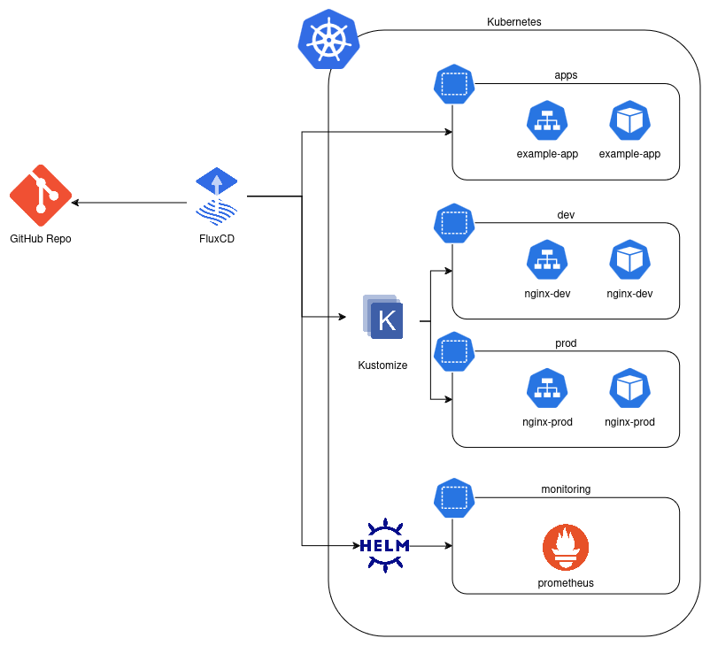

# FluxCD Studies

FluxCD is a GitOps tool designed for continuous delivery of applications and infrastructure to Kubernetes. It synchronizes your cluster's state with the desired state defined in a Git repository, ensuring consistency and repeatability. Flux automates the deployment of Kubernetes manifests, Helm charts, and other Kubernetes-native resources directly from version-controlled repositories.

## FluxCD Key Features

Those are the FluxCD key features:

- `GitOps Workflow`: Flux operates on the principle of GitOps, where the Git repository serves as the single source of truth. It continuously monitors your Git repository and applies any changes to the cluster.

- `Declarative Configuration`: Flux uses declarative configuration for Kubernetes resources. This means the desired state is fully described in YAML or Helm manifests.

- `Automated Deployments`: Flux automates the deployment process, applying changes from Git to the cluster without manual intervention.

- `Helm Chart Support`: It supports deploying applications through Helm charts, including managing dependencies and values.

- `Drift Detection`: Flux detects drift between the desired state in Git and the actual state of the cluster and automatically reconciles them.

- `Multi-tenancy and Scoping`: It supports scoped deployments, enabling different teams to work independently within the same cluster.

- `Extensible Ecosystem`: Flux integrates with multiple tools like Helm, Kustomize, and SOPS (for secrets management).

## Demo Project
---

The purpose of this demo project is to provision a local kubernetes Cluster using [KinD](https://kind.sigs.k8s.io/), configure FluxCD with the current repository performing the following releases



1. [StandardK8sManifests](./01-StandardK8sManifests.md) - A simple Python Flask Application which have standard K8s manifests
2. [KustomizeWithK8sManifests](./02-KustomizeK8sManifests.md) - Two Nginx Releases one representing Development and one Production, using Kustomize to overwrite the standard K8s accordingly to the environment
3. [HelmManifests](./03-HelmManifests.md) - Installation of kube-prometheus-stack using Helm and Flux
4. Installation of custom helm chart being part of a git repository

## Requisites
---

1. [Install Docker](https://docs.docker.com/engine/install/ubuntu/)
2. [Install Kind](https://kind.sigs.k8s.io/docs/user/quick-start)
3. [Install Kubectl](https://kubernetes.io/docs/tasks/tools/install-kubectl-linux/)
4. [Install Flux](https://fluxcd.io/flux/installation/)
5. Create a Github Repo - Will be used by Flux
6. [Create a Github PAT](https://docs.github.com/en/authentication/keeping-your-account-and-data-secure/managing-your-personal-access-tokens)

## Setup
---

These are the steps required in order to following this guide


1. Create a local Kubernetes Cluster via Kind
```bash
kind create cluster --name demo --config ./artifacts/kind/multi-node.yml
kubectl config use-context kind-demo
```

2. Deploy Flux
```bash
export GITHUB_TOKEN=<gh-token> # Add the your PAT Token here
flux bootstrap github \
  --token-auth \
  --owner=tmissao \
  --repository=fluxcd-studies \
  --branch=master    \
  --path=artifacts/fluxcd/clusters/demo \
  --personal \
  --namespace=flux-system
```

3. Check out the releases's steps that you are interested


## Resources
---

- [Documentation](https://fluxcd.io/flux/concepts/)
- [Tutorial](https://www.youtube.com/watch?v=X5W_706-jSY)